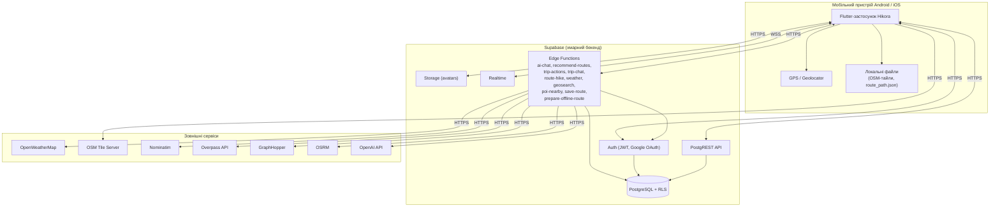
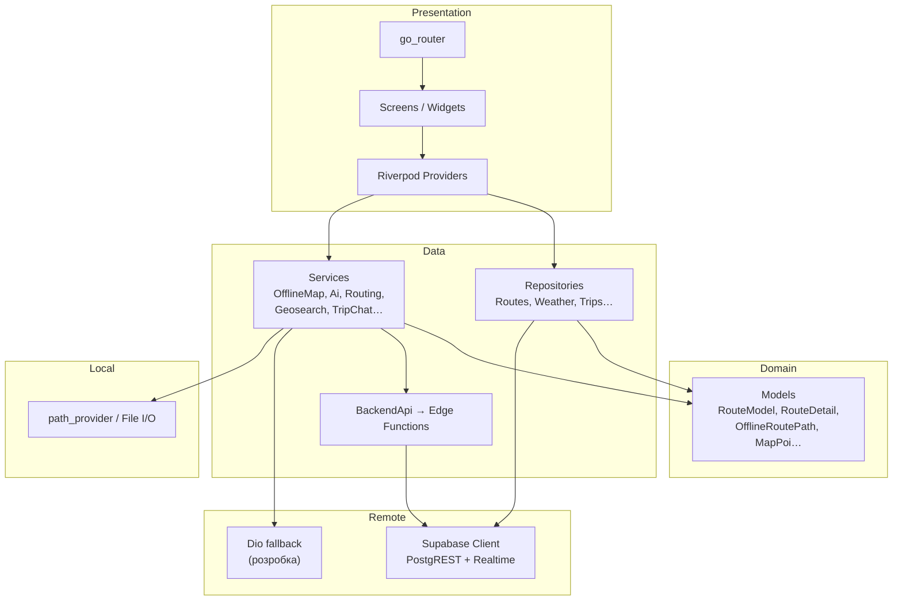
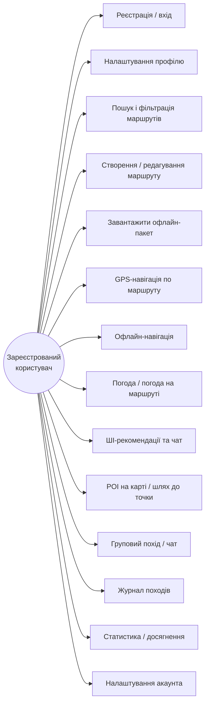
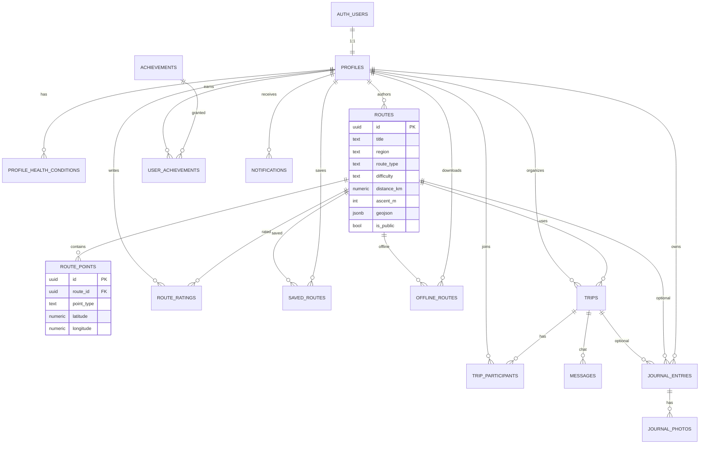
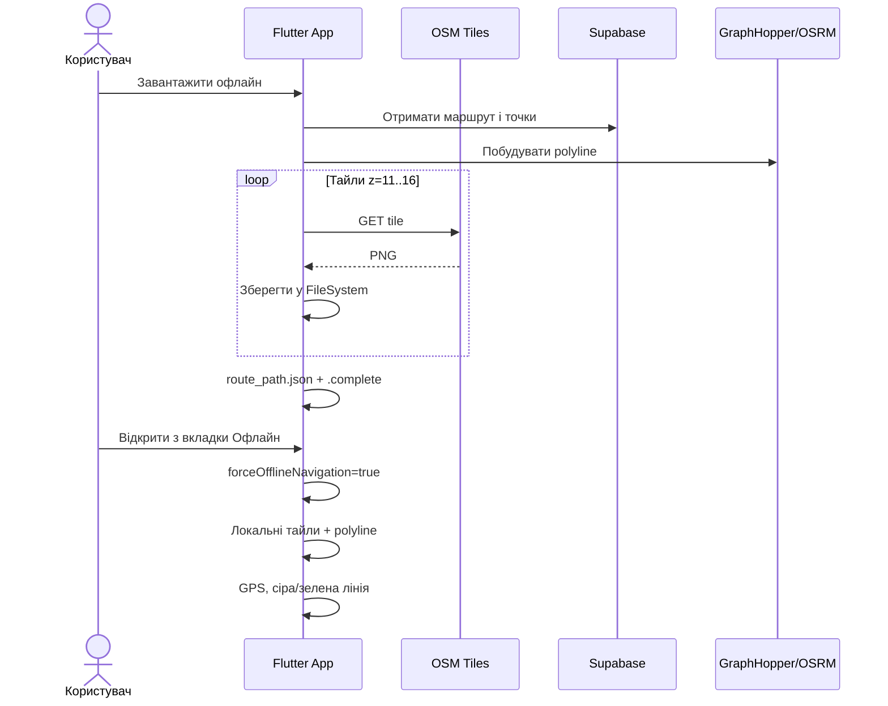
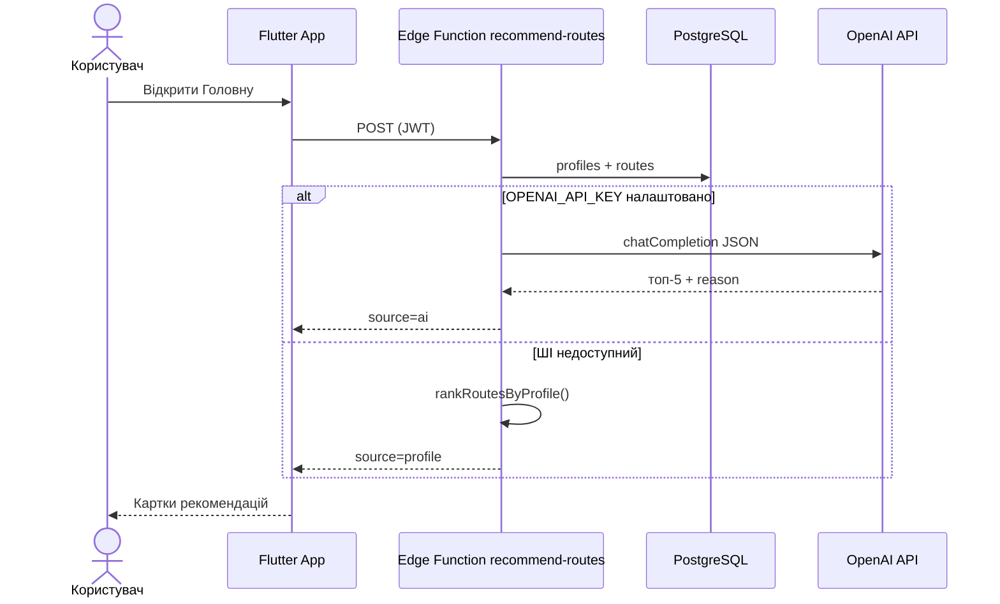
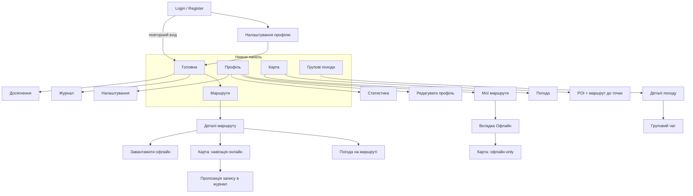

# Розділ 3. Аудит архітектури Hikora та діаграми

Документ узгоджує текст диплома (розділ 3) з фактичною реалізацією Flutter-застосунку.  
Діаграми в форматі **Mermaid** — рендер: [mermaid.live](https://mermaid.live) або розширення Mermaid у VS Code.

**PlantUML (строгий UML 2 — компоненти, інтерфейси, стереотипи):** [rozdim-3-diagramy.puml](./rozdim-3-diagramy.puml) — рендер: [plantuml.com](https://www.plantuml.com/plantuml/uml/) або VS Code (PlantUML, `Alt+D`).

**Концептуальна модель БД:** [kontseptualna-model-bd.md](./kontseptualna-model-bd.md) + [kontseptualna-model-bd.puml](./kontseptualna-model-bd.puml) (`fig_conceptual_db_hikora`).

| Файл `.puml` | Тип UML |
|--------------|---------|
| `fig_3_1_deployment` | Deployment Diagram |
| `fig_3_2_component_client` | **Component Diagram — клієнтська частина** (модулі, репозиторії, сервіси) |
| `fig_3_2_component_server` | **Component Diagram — серверна частина** (Supabase, Edge Functions, БД) |
| `fig_3_2_component_layers` | Component Diagram (шари клієнта, абстрактна) |
| `fig_3_2b_component_system` | Component Diagram (система: клієнт — сервер — API) |
| `fig_3_3_usecase` | Use Case Diagram |
| `kontseptualna-model-chen-1.dot` | **Концептуальна модель, нотація Чена** (рис. 3.4) — [kontseptualna-model-chen.md](./kontseptualna-model-chen.md) |
| `kontseptualna-model-chen-2.dot` | **Чена** (рис. 3.4б): походи, журнал, досягнення |
| `fig_3_4_er` | **Логічна модель БД** (Class Diagram, атрибути та типи) |
| `fig_3_5_sequence_offline` | Sequence Diagram |
| `fig_3_6_sequence_ai` | Sequence Diagram |
| `fig_3_7_component_ui` | Component Diagram (екрани) |
| `fig_3_7_activity_create_route` | **Activity Diagram** — створення маршруту (`RouteEditorScreen`, `save-route`) |
| `fig_3_8_sequence_create_route` | Sequence — створення маршруту |
| `fig_3_9_sequence_group_trips` | Sequence — групові походи: створення, заявка, рішення організатора (об’єднано) |
| `fig_3_11_sequence_trip_chat` | Sequence — груповий чат (`trip-chat` + Realtime) |

---

## 0. Діаграми компонентів для розділу 3 (клієнт і сервер)

Для підрозділу про архітектуру ПЗ у **розділі 3** використовуйте дві нові діаграми з `rozdim-3-diagramy.puml`:

| Рисунок у дипломі | PlantUML `@startuml` | Зміст |
|-------------------|----------------------|--------|
| **Рис. 3.2** | `fig_3_2_component_client` | Клієнт: `lib/core`, модулі `features/*`, репозиторії, Supabase/Dio/файли |
| **Рис. 3.2а** | `fig_3_2_component_server` | Сервер: PostgREST, Auth, Realtime, Storage, Edge Functions, групи таблиць PostgreSQL + RLS |

**Як згенерувати:** відкрийте `rozdim-3-diagramy.puml` у VS Code → PlantUML → Preview Current Diagram (курсор у блоці `@startuml fig_3_2_component_client` або `fig_3_2_component_server`). Експорт PNG/SVG — для вставки в Word.

**Текст до рис. 3.2 (приклад):**  
> На рис. 3.2 зображено компонентну структуру клієнтської частини: спільне ядро (`AppRouter`, `MainShell`), функціональні модулі за принципом feature-first та інфраструктурні компоненти доступу до Supabase, HTTP (Dio) і локального сховища офлайн-пакетів.

**Текст до рис. 3.2а (приклад):**  
> На рис. 3.2а наведено компоненти серверної частини на платформі Supabase: сервіси API, Edge Functions (BFF-шар: `ai-chat`, `recommend-routes`, `trip-actions`, `trip-chat`, `route-hike`, `weather`, `geosearch`, `poi-nearby`, `save-route`, `prepare-offline-route`), логічні групи таблиць PostgreSQL із RLS. Зовнішні API (OpenWeather, GraphHopper, OSRM, Nominatim, Overpass, OpenAI) викликаються **лише з Edge**; ключі — у Supabase Secrets.

*Примітка:* серверна діаграма нумерується **3.2а**, щоб не конфліктувати з **Рис. 3.3** (use case, `fig_3_3_usecase`). За бажанням обидві можна зробити 3.2 і 3.3, зсунувши use case на 3.4.

Додатково (за потреби):

- `fig_3_1_deployment` — розгортання (пристрій + хмара + зовнішні API);
- `fig_3_2b_component_system` — загальна схема «клієнт ↔ сервер ↔ зовнішні API»;
- `fig_3_2_component_layers` — абстрактні шари (presentation / domain / data).

### Концептуальна модель БД (рис. 3.4, нотація Чена)

DOT-файли (рендер: [Graphviz Online](https://dreampuf.github.io/GraphvizOnline/)) — див. [kontseptualna-model-chen.md](./kontseptualna-model-chen.md):

| Рисунок | Файл | Зміст |
|---------|------|--------|
| **3.4** | [kontseptualna-model-chen-1.dot](./kontseptualna-model-chen-1.dot) | Профіль, медична умова, маршрут, точки, оцінка, збереження, офлайн |
| **3.4б** | [kontseptualna-model-chen-2.dot](./kontseptualna-model-chen-2.dot) | Похід, участь, чат, журнал, фото, досягнення, сповіщення |

**Нотація (як у методичному зразку):** прямокутник — сутність, овал — атрибут, ромб — зв’язок, на лініях — кардинальність (1, N, M).

**Текст до рис. 3.4 (приклад):**  
> На рис. 3.4–3.4б наведено концептуальну модель бази даних Hikora у нотації Чена. Сутність «Користувач» описується атрибутами ідентифікатор, повне ім’я, рівень підготовки; сутність «Маршрут» пов’язана з «Точка маршруту» зв’язком «містить» (1:N). Зв’язки «зберігає» та «завантажує офлайн» реалізують асоціації користувача з маршрутом (M:N). На рис. 3.4б показано підсистему групових походів і журналу походів.

Логічна модель з типами полів PostgreSQL — **`fig_3_4_er`** у `rozdim-3-diagramy.puml` (рис. 3.4а).

---

## 1. Критичні розбіжності (обов’язково виправити в тексті)

| Місце в дипломі | Зараз у тексті | Як у програмі |
|-----------------|----------------|---------------|
| **3.1, зовнішні API** | Anthropic Claude API | **OpenAI API** (`gpt-4o-mini`) через **Supabase Edge Functions** (`ai-chat`, `recommend-routes`); резерв — ранжування за профілем без ШІ |
| **3.2, обмін з БД** | «за принципом ORM» | **Немає ORM**: `supabase_flutter` + PostgREST, ручне мапування в `*Repository` / `*Model` |
| **3.3, відхилення від маршруту** | push-сповіщення | **SnackBar / підпис на екрані** + **перебудова маршруту** (GraphHopper/OSRM); FCM push не реалізовано |
| **3.1, зовнішні API** | лише OpenWeather + OSM | Додати: **GraphHopper**, **OSRM**, **Overpass**, **Nominatim** |
| **3.1, Supabase** | REST + Auth + Storage | + **Edge Functions**, **Realtime**, **RLS** |
| **3.1, локальне сховище** | загальний «кеш» | **Файлова система** (`path_provider`): тайли OSM + `route_path.json` + `.complete`; Hive у `pubspec` не використовується в `lib/` |
| **3.2, routes** | region, без route_type | Є **`route_type`**; фільтр за типом у UI; фільтр за **регіоном** у UI немає |
| **3.2, Storage** | медіафайли маршрутів | **Аватари** (bucket `avatars`); обкладинки — URL у БД |
| **Нумерація рис.** | плутанина 3.2 / 3.3 | Рекомендація: **3.1** deployment, **3.2** use case, **3.3** ER, **3.4+** поведінка/UI |

---

## 2. Доповнення до тексту (середній пріоритет)

### 3.1 Архітектура клієнта

Клієнт організовано за **модульним (feature-first) підходом**: `auth`, `routes`, `navigation`, `weather`, `trips`, `journal`, `profile`, `ai`, `home`. У кожному модулі — шари **presentation** (екрани, Riverpod), **data** (репозиторії, сервіси), **domain** (моделі). Навігація — **go_router**, карта — **flutter_map** + OSM-тайли.

**Офлайн:**

- завантаження **пакета**: тайли карти + лінія шляху (`route_path.json`);
- **два режими навігації**: класична (онлайн, reroute, POI) і **офлайн-only** (`/navigation?routeId=…&offline=true` з вкладки «Офлайн»).

### 3.2 База даних

- У `routes` додати опис поля **`route_type`** (circular / linear / radial / combined).
- `route_ratings`, `saved_routes` — **є в схемі**; UI оцінок/«обраного» у поточній версії **не реалізований** (вказати в дипломі чесно, якщо залишається так).

### 3.3 Поведінка

Додати: ШІ-чат і рекомендації на головній; погода на маршруті; POI на карті; перебудова маршруту; Realtime-сповіщення походів (in-app); екрани статистики, досягнень, налаштувань.

### 3.4 Інтерфейс

Нижня панель: **Головна | Маршрути | Карта | Групи | Профіль**.  
Журнал і загальна погода — **не** вкладки bottom bar (доступ з Home / Профілю / деталей маршруту / карти).

---

## 3. Готові фрагменти для вставки в диплом

### Зовнішні API (замість Claude)

> Зовнішні API: **OpenWeatherMap**, **GraphHopper/OSRM**, **Nominatim/Overpass**, **OpenAI** — інтеграція через **Supabase Edge Functions** (секрети на сервері). **OSM-тайли** завантажує клієнт напряму (офлайн-пакет). Клієнтський `BackendApi` викликає Edge; при недоступності функцій — локальний fallback (Dio).

### Доступ до даних (замість ORM)

> Обмін із PostgreSQL здійснюється через **Supabase Dart SDK** (PostgREST): репозиторії формують запити `.from('table').select()`, а результати перетворюються на Dart-моделі вручну. Це **repository pattern** поверх REST API, а не ORM.

### Відхилення від маршруту

> При відхиленні від маршруту — **попередження в UI** та перебудова треку через Edge Function **`route-hike`** (GraphHopper/OSRM на сервері). Події походів і чату — **Supabase Realtime** + in-app SnackBar (`trip_request`, `trip_approved`, `new_message`). FCM push не реалізовано.

---

## 4. Діаграми

### Рис. 3.1 — Діаграма розгортання

---

### Рис. 3.2 — Внутрішні шари клієнта та модулі

---

### Рис. 3.3 — Варіанти використання (розширена)

---

### Рис. 3.4 — ER-діаграма (скорочена)

---

### Рис. 3.5 — Послідовність: офлайн-завантаження та навігація

---

### Рис. 3.6 — Послідовність: ШІ-рекомендації

---

### Рис. 3.7 — Діаграма діяльності: створення маршруту

PlantUML: `fig_3_7_activity_create_route` у [rozdim-3-diagramy.puml](./rozdim-3-diagramy.puml). Доповнює **рис. 3.8** (sequence): показує гілки валідації, паралельний пошук точок і резервне збереження через PostgREST.

**Текст до рис. 3.7 (приклад):**  
> На рис. 3.7 наведено діаграму діяльності процесу створення маршруту. Користувач відкриває повноекранний редактор (`RouteEditorScreen`), задає метадані та точки (старт, фініш, за потреби проміжні). Для кожної назви довжиною від трьох символів система паралельно опитує каталог існуючих `route_points` і зовнішній геопошук (Edge `geosearch` / Nominatim), після чого локально перераховує попередні метрики. При збереженні виконується валідація форми; основний шлях — виклик Edge Function `save-route` (маршрутизація `route-hike`, запис `routes` і `route_points`). За недоступності Edge застосовується fallback через `RoutesRepository` і PostgREST.

---

### Рис. 3.7а — Wireflow екранів

---

## 5. Checklist перед здачею розділу 3

- [x] Claude → **OpenAI + Edge Functions**
- [x] ORM → **Supabase SDK + repositories**
- [x] Зовнішні API → **Edge Functions (BFF)**; тайли OSM — клієнт
- [x] **trip-actions:** create, apply, decide, …
- [x] **trip-chat** + Realtime + `new_message`
- [x] **route-hike, save-route, prepare-offline-route, weather, geosearch, poi-nearby**
- [ ] Push при відхиленні → **UI + reroute** (через `route-hike`); FCM — ні
- [ ] Описати **route_type**, офлайн-пакет, два режими навігації
- [ ] **Feature-first + Riverpod + go_router**
- [ ] Use case / wireflow: ШІ, POI, статистика, налаштування, офлайн-вкладка
- [ ] **route_ratings / saved_routes** — у БД є, у UI поки ні
- [ ] Діаграми: `rozdim-3-diagramy.puml` (рис. 3.11 — чат)

---

## 6. Ключові шляхи в коді (для перевірки)

| Тема | Файли |
|------|--------|
| Edge invoke (клієнт) | `lib/core/api/backend_api.dart` |
| Маршрутизація | `routing_repository.dart` → `route-hike` |
| Збереження маршруту | `save_route_api.dart` → `save-route` |
| Офлайн-лінія | `prepare_offline_api.dart` → `prepare-offline-route` |
| Погода / геопошук / POI | `weather_repository.dart`, `osm_nominatim_service.dart`, `overpass_poi_repository.dart` |
| Походи | `trips_api.dart` → `trip-actions` |
| Чат | `trip_chat_api.dart` → `trip-chat`; Realtime у `trips_providers.dart` |
| Офлайн-тайли | `offline_map_service.dart` (клієнт → OSM) |
| ШІ | `ai_service.dart`, `supabase/functions/ai-chat/`, `recommend-routes/` |
| Edge deploy | `supabase/DEPLOY_EDGE_FUNCTIONS_UA.txt` |
| Realtime SQL | `supabase/realtime_publication.sql` |

---

*Оновлено: архітектура BFF (Edge Functions), групові походи з чатом і Realtime. Діаграми: `rozdim-3-diagramy.puml`.*
